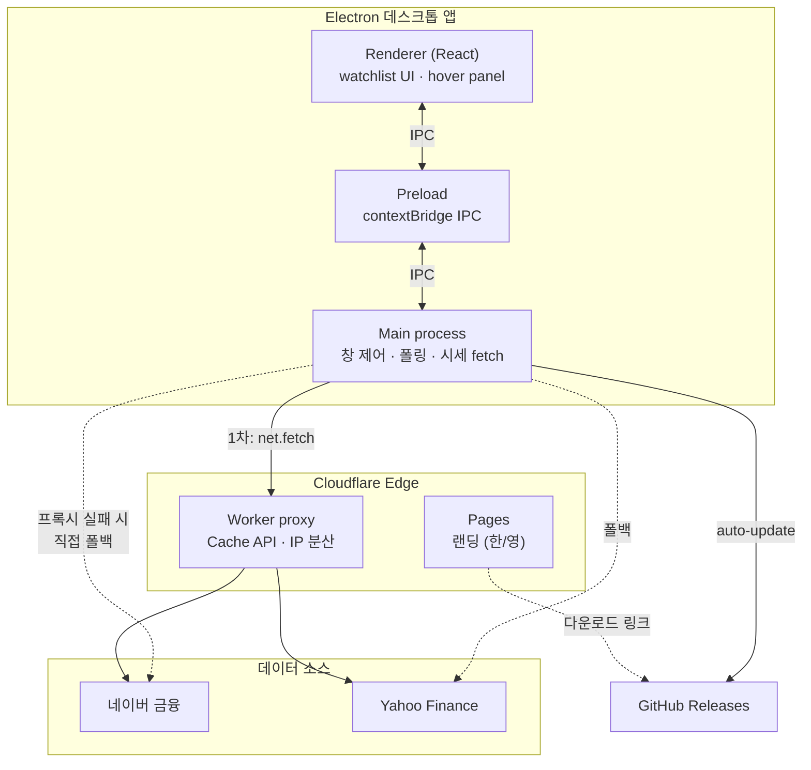
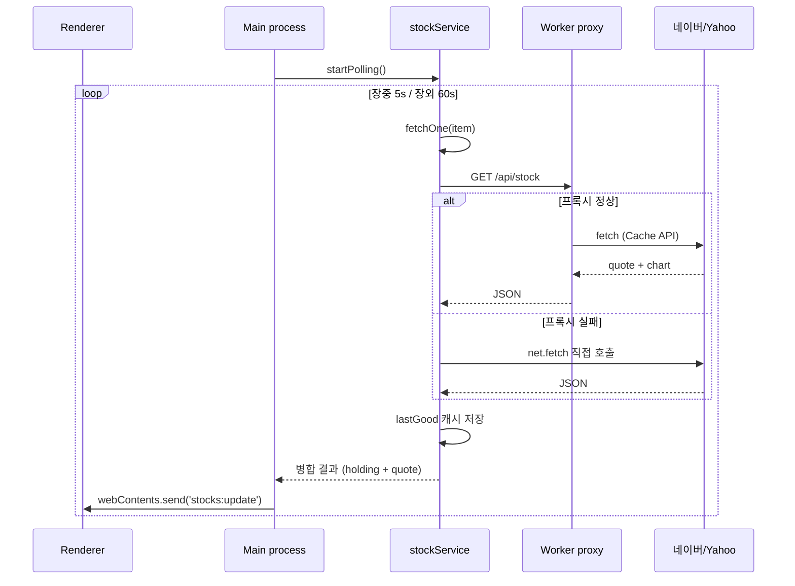

# 몰래주식 (Stock Peek)

[](https://github.com/sngmng6506/stock-peek/releases/latest)
[](LICENSE)

화면 가장자리에 마우스만 가져가면 관심 종목 시세가 슬라이드로 나타나는 Windows 데스크톱 위젯. 한국·미국 주식 지원.

**[stock-peek.com](https://stock-peek.com/)** · [English](https://stock-peek.com/en)

> 일하다가 몰래, 게임하다가 몰래 — 시세만 빠르게.

<!-- TODO: 데모 GIF 추가 (앱 hover → 슬라이드 인 장면 5~6초 녹화 후 아래 경로에 배치) -->
<!--  -->

## 다운로드

[Releases](https://github.com/sngmng6506/stock-peek/releases/latest)에서 최신 `.exe` 설치 파일을 받으세요. 설치 후 새 버전은 앱 안에서 자동으로 알려줍니다.

## 기능

- 화면 가장자리 hover → 패널 슬라이드 인, 벗어나면 사라짐
- 한국 종목 (네이버 금융) + 미국 종목 (Yahoo Finance)
- 종목명·티커로 검색해서 추가, 보유 수량·평단가 입력 시 평가손익 표시
- 최근 3개월 일봉 sparkline 차트
- 드래그로 순서 변경 / 좌·우 모서리 도킹 / 멀티모니터 지원
- 한국어·English (OS 언어 자동 감지 + 설정에서 전환)
- 트레이 아이콘 + 윈도우 시작 시 자동 실행
- 장중 5초 / 장외 60초 적응형 갱신
- 네트워크 끊김 시 마지막 가격 유지

## 개발

```bash
npm install
npm run dev          # 개발 서버 + Electron
npm run build:win    # Windows installer 빌드 → dist/
```

## 아키텍처

### 전체 구성



### 시세 요청 흐름



### 핵심 설계 결정

| 영역 | 선택 | 이유 |
|------|------|------|
| HTTP 클라이언트 | Electron `net.fetch` | 시스템 프록시·인증서 자동 적용 → 사내망에서도 동작 |
| 프록시 | Cloudflare Worker + 직접 폴백 | edge 캐싱·IP 분산을 얻되, 프록시 장애 시 앱이 직접 호출해 가용성 유지 |
| 폴링 | 장중 5s / 장외 60s 적응형 | 불필요한 요청 최소화 (서머타임 반영 ET 계산) |
| 시세 병합 | `{...quote, ...holding}` spread | API 응답이 사용자 입력(평단가·수량)을 덮어쓰지 못하게 |
| 네트워크 방어 | `lastGood` Map 캐시 | 일시적 fetch 실패 시 마지막 가격 유지 + stale 표시 |
| 멀티모니터 | `displayId` 저장 + `getDisplayNearestPoint` | 드롭한 모니터 판정, 연결 해제 시 primary 폴백 |
| i18n | data-attr 사전 + Context | 런타임 토글, OS locale 자동 감지 |
| 배포 | tag push → GitHub Actions → electron-builder | `latest.yml` 발행으로 인앱 자동 업데이트 |

### 디렉터리

```
src/
├── main/              # Electron 메인 프로세스
│   ├── index.js       #   창·트레이·IPC·폴링·auto-update 오케스트레이션
│   ├── stockService.js#   적응형 폴링 + lastGood 캐시 + 시세 병합
│   ├── watchlist.js   #   관심종목 CRUD (electron-store)
│   ├── preferences.js #   설정 영속화 (dock·언어·welcome)
│   └── api/           #   naver.js · yahoo.js · proxy.js (net.fetch)
├── preload/index.js   # contextBridge 화이트리스트 IPC
└── renderer/src/      # React UI
    ├── App.jsx        #   레이아웃·dnd·패널 높이 측정
    ├── components/    #   StockCard · 모달들 · Sparkline
    └── i18n/          #   번역 사전 + Provider

server/src/worker.js   # Cloudflare Worker proxy (Cache API)
website/               # 랜딩 페이지 (Pages, 한/영)
```

Electron 메인 프로세스는 `net.fetch`로 시스템 프록시/인증서를 그대로 사용하므로 사내망 등에서도 동작합니다.

## 라이선스

[MIT License](LICENSE)

## 문의

[sngmng6506@gmail.com](mailto:sngmng6506@gmail.com) · [Buy Me a Coffee ☕](https://buymeacoffee.com/sngmng)